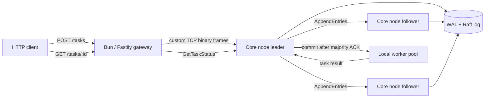
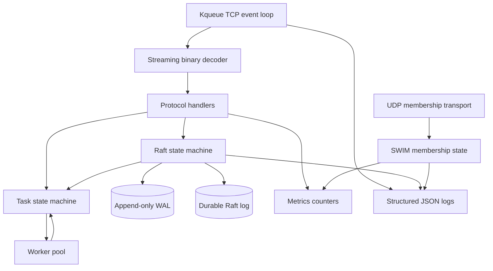
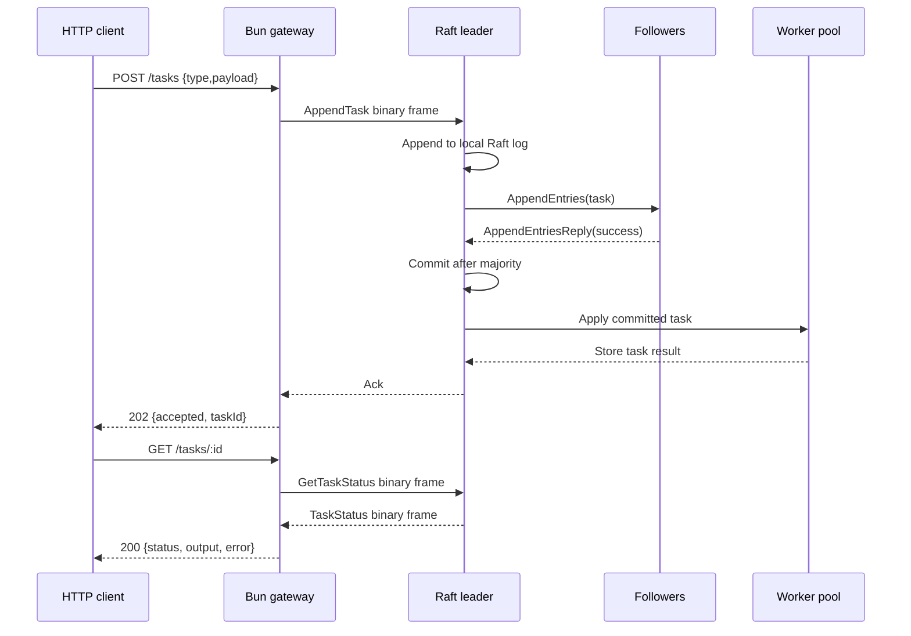
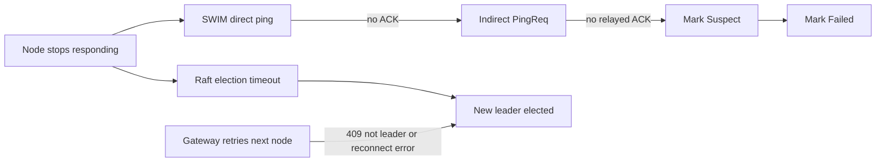
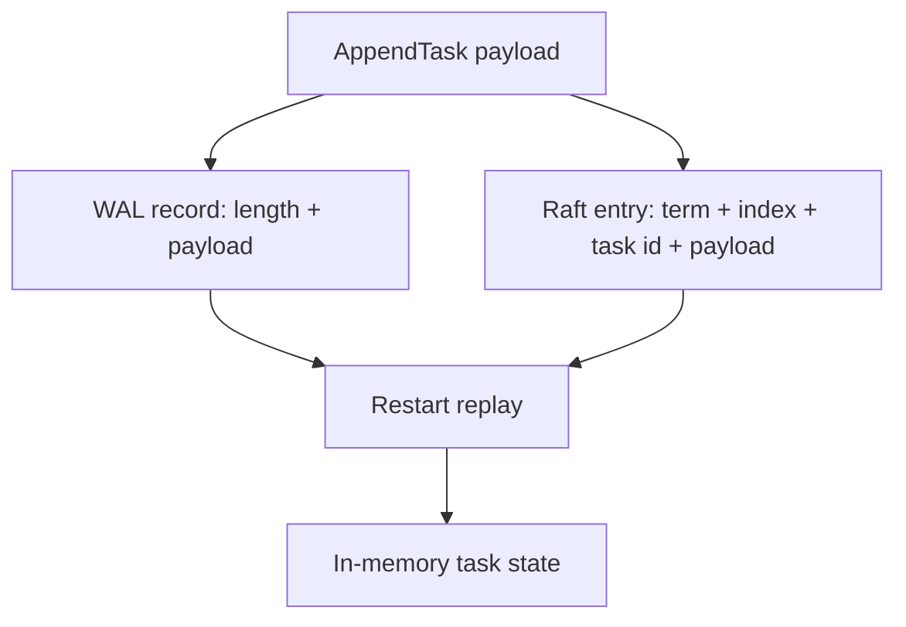

# Architecture

The system has two primary runtimes:

- Core nodes: Rust binaries that own persistence, membership, consensus, and task execution.
- API gateway: Bun and TypeScript service that exposes HTTP endpoints and speaks the binary protocol to core nodes.

## System Overview

The gateway is intentionally thin: it validates HTTP requests, maintains cluster sockets, follows not-leader responses, and translates between JSON and the binary protocol. The Rust core owns the distributed-system behavior.

Core node modules are intentionally decoupled:

- `storage`: append-only WAL and indexing.
- `protocol`: binary frame encoding and decoding.
- `net`: raw socket event loop and transport concerns.
- `membership`: SWIM member state and dissemination.
- `raft`: consensus state machine and RPC handling.
- `task`: committed task representation and execution handoff.

## Core Node Internals

The Raft state machine must remain testable without sockets, threads, or disk.

The SWIM membership state machine follows the same rule: membership conflict resolution, join handling, probe target selection, and ping/ACK state are pure logic. UDP transport only carries membership messages and should not own membership decisions.

## Task Submission Flow

## Failure Handling

SWIM and Raft are separate on purpose. SWIM gives operators a membership view and failure dissemination. Raft decides write availability and commit safety.

## Persistence Boundaries

The WAL is deliberately strict: truncated headers or payloads are rejected instead of silently repaired. Snapshot and compaction are planned in `docs/wal-compaction.md` but not automatic yet.
